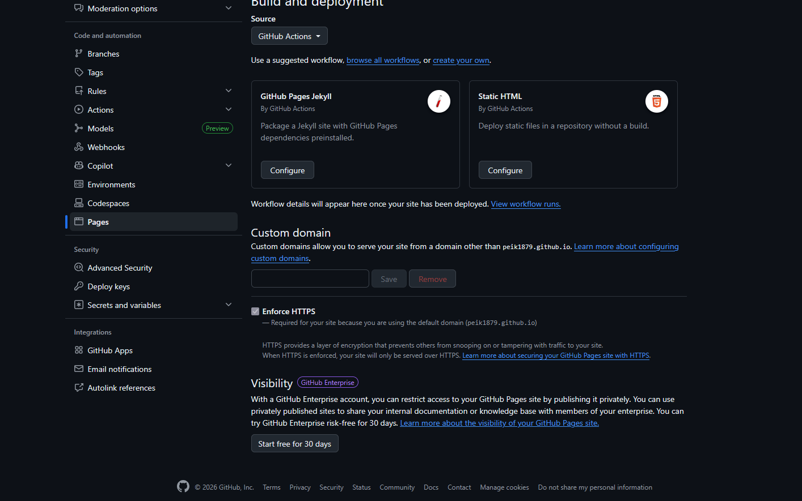

# Oberlinhaus Werkstatt Portal - Nächste Schritte

Der MVP (Minimum Viable Product) ist fertig! Hier ist dein Roadmap zum Live-Gehen:

## 🚀 JETZT TESTEN (Lokal)

### 1. MySQL installieren (falls nicht vorhanden)
- **Windows:** [MySQL Installer](https://dev.mysql.com/downloads/installer/)
- **Mac:** `brew install mysql`
- **Linux:** `sudo apt install mysql-server`

### 2. Project-Setup
```bash
cd oberlin-webseite
npm install
cp .env.example .env
# Dann .env anpassen mit deinen MySQL-Daten
npm run db:init
npm run dev
```

### 3. Im Browser testen
```
http://localhost:3000
Login: admin / 0000
```

### 4. Features testen
- [ ] Login funktioniert (PIN und Email)
- [ ] Dashboard lädt
- [ ] Speiseplan, Anwesenheit, Umfragen funktionieren
- [ ] Schriftgröße-Button funktioniert
- [ ] Vorlesen-Button funktioniert (Sound an!)
- [ ] Leichte Sprache-Button funktioniert

---

## 📤 ZUM GITHUB PUSHEN

```bash
# Im Projektverzeichnis
git init
git add .
git commit -m "Initial: Oberlinhaus Workshop Portal MVP"
git branch -M main
git remote add origin https://github.com/deinusername/oberlin-webseite.git
git push -u origin main
```

---

## 🌍 ZU RAILWAY/VERCEL DEPLOYEN

### Für Railway (empfohlen):
1. [railway.app](https://railway.app) öffnen
2. GitHub verbinden
3. Dein Repo auswählen
4. MySQL Datenbankservice hinzufügen
5. Umgebungsvariablen setzen
6. Deploy!

Siehe auch: [DEPLOYMENT.md](DEPLOYMENT.md)

---

## 📋 Noch zu machen (Phase 2-3)

### Phase 2: Vollständigkeit
- [ ] Admin-Panel für Datenverwaltung
- [ ] File-Upload für Tickets/Dokumente (Multer Config)
- [ ] Export-Funktionen (PDF, Drucken)
- [ ] Kontakt/Impressum/Datenschutz Seiten
- [ ] Newsletter/Email-System

### Phase 3: Features erweitern
- [ ] Betreuer-Dashboard (Anwesenheit-Übersicht)
- [ ] Statistiken & Reports
- [ ] Benachrichtigungen
- [ ] Mobile-App (React Native optional)
- [ ] Video/Audio-Inhalte

### Phase 4: Skalierung
- [ ] Load-Testing
- [ ] Performance-Optimierung
- [ ] SEO
- [ ] Mehrsprachigkeit (Englisch, etc.)
- [ ] Benutzerverwaltungs-API

---

## 🔒 Wichtig: Sicherheit VOR Production!

- [ ] `.env` wird NICHT ins Repo gepusht (gitignore prüfen)
- [ ] `SESSION_SECRET` neu generieren
- [ ] HTTPS aktivieren (Railway tut das automatisch)
- [ ] Rate-Limiting auf Login (DDoS-Schutz)
- [ ] Input-Validierung überall (express-validator)
- [ ] SQL-Injection Tests (alle using Prepared Statements ✅)
- [ ] CSRF Token für Forms hinzufügen
- [ ] Sichere Cookie-Settings prüfen

---

## Datenbank-Struktur verstehen

Die MySQL-Tabellen wurden mit `npm run db:init` erstellt:

```
users               → Benutzer mit Rollen
meal_plans          → Speiseplan pro Wochentag
opening_hours       → Öffnungszeiten
attendance          → Anwesenheit der User
surveys             → Umfragen & Abstimmungen
survey_answers      → Antworten zu Umfragen
offers              → Freizeitangebote
trainings           → Kurse & Weiterbildungen
tickets             → Fahrkarten-Upload
documents           → Bewerbungsdokumente
jobs                → Job-Angebote
announcements       → News & Meldungen
accessibility_settings → User-Preferences (Schrift, Sprache)
```

Alle Tabellendefinitionen sind in [server/config/initDB.js](server/config/initDB.js)

---

## Test-Daten hinzufügen

Sind automatisch beim `npm run db:init` erstellt:

**Admin-Account:**
- Username: `admin`
- PIN: `0000`
- Role: `admin`

**Weitere Test-User erstellen:**

```sql
INSERT INTO users (username, email, password_hash, pin, firstname, lastname, role) 
VALUES 
('max.mueller', 'max@example.de', '$2a$10$...', '1234', 'Max', 'Müller', 'employee'),
('petra.schmidt', 'petra@example.de', '$2a$10$...', '5678', 'Petra', 'Schmidt', 'supervisor');
```

---

## API-Schnelle Referenz

```bash
# Account
POST /api/auth/login-pin { username, pin }
POST /api/auth/login { email, password }
POST /api/auth/logout
GET /api/auth/me

# Daten
GET /api/meal-plans
GET /api/attendance/me
POST /api/attendance { date, status, notes }
GET /api/surveys
POST /api/surveys/:surveyId/answer { optionId }
```

Alle Endpoints sind in den Route-Dateien dokumentiert.

---

## Häufige Fehler & Lösungen

| Problem | Lösung |
|---------|--------|
| "Cannot find module" | `npm install` erneut ausführen |
| "ECONNREFUSED MySQL" | MySQL nicht laufen / falsche Credentials in `.env` |
| "Port 3000 already in use" | andere Port in `.env` setzen oder `kill -9 $(lsof -t -i:3000)` |
| "Session not saving" | Browser-Cookies prüfen / Incognito-Mode versuchen |
| "Datei-Upload funktioniert nicht" | Checker: `/public/uploads` Ordner vorhanden? Permissions OK? |

---

## Unterstützung

Wenn etwas nicht funktioniert:

1. **Logs prüfen:** Terminal-Output ansehen
2. **Browser-Console:** F12 → Console Tab
3. **Network Tab:** API-Responses prüfen
4. **MySQL:** `mysql -u root -p` → `SELECT * FROM users;`
5. **GitHub Issues:** Dokumentieren & Issues erstellen

---

## Lizenz & Credits

- Node.js, Express, MySQL: Open Source ✅
- Icons: Unicode Emojis (kostenlos)
- Design: Oberlinhaus Corporate Design
- Accessibility: WCAG 2.1 Richtlinien

---

## Viel Erfolg! 🚀

Das Portal ist jetzt einsatzbereit. Viel Spaß damit und needing help? GitHub-Issues stellen!

**Nächster Termin:** Phase 2 mit Admin-Interface & erweiterten Features?
